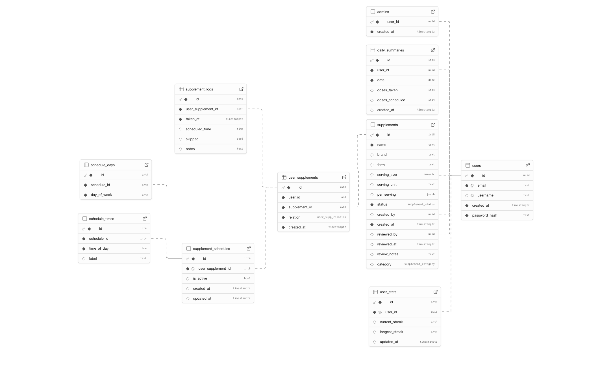

# HealthTrack

> Seguimiento de suplementos con reconocimiento por imagen e interfaz Admin/Cliente. Extracción automática de nombre de compuesto, marca y datos por porción usando IA, con curación por administradores.

## Características Clave

- Reconocimiento visual con IA: Gemini 2.5 Flash para leer etiquetas de suplementos.
- Normalización multilingüe: detección en inglés/español y estandarización de form y serving_unit.
- Sugerencia por nombre: si existe versión publicada “Generic”, el usuario puede agregarla o enviar su marca a revisión.
- Curación admin: edición completa del producto (PUT) y publicación/rechazo, con conversión automática de submitted → uses.
- Mi Stack: vista del usuario con suplementos en uso, datos por porción, búsqueda y eliminación con confirmación.

## Tabla de Contenidos

- Resumen del Proyecto
- Arquitectura del Sistema
- IA y Reconocimiento
- Estructura del Proyecto
- Puesta en Marcha (local)
- Configuración
- Frontend (Vistas y UX)
- Operaciones CRUD (principales)
- Esquema de Base de Datos
- Despliegue
- Link deployment
- Video
- Conclusiones

## Resumen del Proyecto

HealthTrack permite a usuarios identificar suplementos desde una foto, comparar con el catálogo y agregarlos a su Stack. Cuando no existe coincidencia exacta, el sistema crea una solicitud pendiente que el equipo Admin revisa y publica. La arquitectura separa responsabilidades por capas y mantiene un flujo de datos claro entre UI, servicios y repositorios.

## Arquitectura del Sistema

```
┌────────────────────┐   HTTP  ┌────────────────────┐   SQL/Drizzle   ┌────────────────────┐
│ Nuxt 4 (Vue 3)     │  ─────▶ │  Nitro + H3 (API)  │ ──────────────▶ │  PostgreSQL (RDS)  │
│ Pages/Layouts      │         │ Services/Repos     │                  │  Supabase Pooler   │
└────────────────────┘         └────────────────────┘                  └────────────────────┘
           │                               │                                      │
           │                               │                                      │
           ▼                               ▼                                      ▼
   Camera Input (Web)           Gemini 2.5 Flash (Vision)                Drizzle ORM (Typed)
```

Ciclos de vida y capas

- Domain (`server/domain/*`): contratos de entrada/salida.
- Repository (`server/repositories/*`): acceso a PostgreSQL con Drizzle.
- Service (`server/services/*`): lógica de negocio, validaciones, matching.
- Controller (`server/controllers/*`): orquestación de servicios.
- API (`server/api/**`): rutas REST con H3.
- Utils (`server/utils/*`): db, auth, gemini.
- Plugin (`server/plugins/bootstrap-db.ts`): bootstrap SQL opcional.

### Ciclo de Vida (flujos principales)

- Autenticación: `POST /api/auth/login` firma cookie; `GET /api/auth/me` expone sesión; `POST /api/auth/logout` invalida cookie.

- Inicio por búsqueda en BD (catálogo):
  1) El usuario navega a `pages/database.vue:1`.
  2) El cliente carga el catálogo publicado con `GET /api/supplements` y aplica filtro local.
  3) Al elegir un producto, hace clic en “Add to Stack” → `POST /api/user/supplements` con `relation='uses'`.
  4) El producto aparece en “Mi Stack”.
  5) Desde "Mi Stack" el usuario puede visualizar nombre, marca, forma, porción (serving_size y serving_unit) y composición por porción (per_serving) en tarjetas, además de buscar/filtrar dentro de su lista y eliminar suplementos con confirmación.
  6) Si no encuentra su producto en el catálogo, puede utilizar el flujo de foto.

- Inicio por foto (reconocimiento):
  1) El cliente captura o selecciona foto en `pages/add-photo.vue:1` y envía `multipart/form-data` a `POST /api/vision/supplement`.
  2) En el backend, `server/api/vision/supplement.post.ts:1` invoca `recognizeSupplementFromImage`.
  3) `visionService` usa Gemini (Vision) para extraer `name` (compuesto), `brand`, `form`, `serving_size`, `serving_unit`, `per_serving` y decide:
     - Match exacto (name+brand, publicado) → UI muestra “Add to My Stack”.
     - Sugerencia “Generic” (coincide name; brand distinta) → UI ofrece “Add Generic” o “Submit Brand”.
     - Sin match → crea `supplements.status='pending'` y `user_supplements.relation='submitted'`.
  4) En Admin, `pages/admin/products.vue:1` permite Curate (PUT + Publish) o Publish directo.
  5) Al publicar, el sistema convierte `submitted` → `uses` en `user_supplements`.
  6) Desde "Mi Stack", el usuario puede visualizar nombre, marca, forma, porción (serving_size y serving_unit) y composición por porción (per_serving), buscar/filtrar en su lista y eliminar suplementos con confirmación.

- Mi Stack: `GET /api/user/supplements` lista suplementos con `relation='uses'`. `DELETE /api/user/supplements/:id` elimina un suplemento del stack (incluye confirmación visual). Vista `pages/stack.vue:1`.

Capas y patrones

- Cliente: `server/utils/gemini.ts` construye el prompt y llama a Gemini 2.5 Flash con la imagen en base64.
- Prompt: fuerza nombre de compuesto (sin dosis), normaliza form y serving_unit a inglés singular, y extrae per_serving en snake_case. Soporta texto en español.
- Matching: `server/services/visionService.ts` prioriza coincidencia exacta name+brand. Si solo coincide el name y hay versión “Generic”, se sugiere usarla o enviar “Submit Brand”. Si no hay coincidencias, se crea un `supplement` en `pending` y se enlaza al usuario con `relation='submitted'`.

## Estructura del Proyecto

- `pages/*`: vistas Cliente/Admin y layouts.
- `server/api/**`: endpoints H3/Nitro.
- `server/services/**`: reglas de negocio (auth, vision, users, supplements).
- `server/repositories/**`: consultas Drizzle.
- `server/db/schema.ts`: esquema PostgreSQL (enums, tablas, índices).
- `server/utils/**`: db pool, auth cookies, gemini client.

## Puesta en Marcha (local)

- Requisitos
  - Node.js 22 LTS (o >= 20.12). `.nvmrc` y `.node-version` incluidos.
  - PostgreSQL o Supabase. Proveer `SUPABASE_DB_POOL_URL` o `DATABASE_URL`.
  - `NUXT_SESSION_SECRET`, `GEMINI_API_KEY`.
- Pasos
  1. `cp .env.example .env` y completar variables.
  2. `nvm use`.
  3. `bun install` (o `npm install`).
  4. `bun run dev`.
  5. (Admin opcional) Normalizar DB: `POST /api/admin/db/ensure-enums` y `POST /api/admin/db/fix-sequences`.

## Configuración

- `SUPABASE_DB_POOL_URL` o `DATABASE_URL`: cadena PostgreSQL.
- `NUXT_SESSION_SECRET`: firma de cookies.
- `GEMINI_API_KEY`: llamadas al modelo Vision.
- `NUXT_DB_BOOTSTRAP`: `1/true` para bootstrap SQL (no con pooler de Supabase).

## Frontend (Vistas y UX)

- Cliente: Dashboard (layout), Mi Stack (`/stack`), Base de Datos (`/database`), Add Photo (`/add-photo`).
- Admin: Login, Resumen, Usuarios, Base de Datos, Curación de Productos (pendientes, Curate, Save & Publish, Publish, Reject).
- Layouts: `default`, `dashboard`, `admin`.

## Operaciones CRUD (principales)

- Autenticación
  - `POST /api/auth/signup` — crea usuario.
  - `POST /api/auth/login` — inicia sesión y firma cookie.
  - `POST /api/auth/logout` — cierra sesión.
  - `GET /api/auth/me` — sesión actual.

- Usuarios (Admin)
  - `GET /api/users` — listar usuarios.
  - `GET /api/users/:id` — obtener usuario por id.
  - `PUT /api/users/:id` — actualizar email/username.
  - `DELETE /api/users/:id` — eliminar usuario.

- Admins (rol)
  - `GET /api/admins` — listar admins.
  - `POST /api/admins` — asignar rol admin (`{ userId }`).
  - `DELETE /api/admins/:userId` — quitar rol admin.

- Suplementos (usuario)
  - `GET /api/supplements` — listado simple.
  - `POST /api/vision/supplement` — analiza imagen, retorna `match`, `generic_suggestion`, `pending` o `no_match`.
  - `POST /api/supplements/submit` — crea pendiente con brand específico, relación `submitted`.
  - `POST /api/user/supplements` — agrega relación (`uses`, `added`, `submitted`).
  - `GET /api/user/supplements` — suplementos del usuario con `relation='uses'`.
  - `DELETE /api/user/supplements/:id` — elimina suplemento del stack del usuario (y horarios asociados).

- Suplementos (Admin)
  - `GET /api/supplements/pending` — lista pendientes.
  - `PUT /api/supplements/:id` — actualiza detalles (name, brand, form, serving_size, serving_unit, per_serving).
  - `POST /api/supplements/:id/publish` — publica y convierte `submitted` → `uses`.
  - `POST /api/supplements/:id/reject` — rechaza con `review_notes`.
  - `GET /api/admin/summary` — métricas.

## Esquema de Base de Datos

- `users` y `admins` para identidad/roles.
- `supplements` con `status` (`draft | pending | published | rejected`).
- `user_supplements` con `relation` (`added | uses | favorite | submitted`).


Esquema (SQL de referencia)


```sql


CREATE TABLE public.admins (
  user_id uuid NOT NULL,
  created_at timestamp with time zone NOT NULL DEFAULT now(),
  CONSTRAINT admins_pkey PRIMARY KEY (user_id),
  CONSTRAINT admins_user_id_fkey FOREIGN KEY (user_id) REFERENCES public.users(id)
);
CREATE TABLE public.daily_summaries (
  id integer NOT NULL DEFAULT nextval('daily_summaries_id_seq'::regclass),
  user_id uuid NOT NULL,
  date date NOT NULL,
  doses_taken integer DEFAULT 0,
  doses_scheduled integer DEFAULT 0,
  created_at timestamp with time zone DEFAULT now(),
  CONSTRAINT daily_summaries_pkey PRIMARY KEY (id),
  CONSTRAINT daily_summaries_user_id_fkey FOREIGN KEY (user_id) REFERENCES public.users(id)
);
CREATE TABLE public.schedule_days (
  id integer NOT NULL DEFAULT nextval('schedule_days_id_seq'::regclass),
  schedule_id integer NOT NULL,
  day_of_week integer NOT NULL CHECK (day_of_week >= 0 AND day_of_week <= 6),
  CONSTRAINT schedule_days_pkey PRIMARY KEY (id),
  CONSTRAINT schedule_days_schedule_id_fkey FOREIGN KEY (schedule_id) REFERENCES public.supplement_schedules(id)
);
CREATE TABLE public.schedule_times (
  id integer NOT NULL DEFAULT nextval('schedule_times_id_seq'::regclass),
  schedule_id integer NOT NULL,
  time_of_day time without time zone NOT NULL,
  label text,
  CONSTRAINT schedule_times_pkey PRIMARY KEY (id),
  CONSTRAINT schedule_times_schedule_id_fkey FOREIGN KEY (schedule_id) REFERENCES public.supplement_schedules(id)
);
CREATE TABLE public.supplement_logs (
  id integer NOT NULL DEFAULT nextval('supplement_logs_id_seq'::regclass),
  user_supplement_id bigint NOT NULL,
  taken_at timestamp with time zone NOT NULL DEFAULT now(),
  scheduled_time time without time zone,
  skipped boolean DEFAULT false,
  notes text,
  CONSTRAINT supplement_logs_pkey PRIMARY KEY (id),
  CONSTRAINT supplement_logs_user_supplement_id_fkey FOREIGN KEY (user_supplement_id) REFERENCES public.user_supplements(id)
);
CREATE TABLE public.supplement_schedules (
  id integer NOT NULL DEFAULT nextval('supplement_schedules_id_seq'::regclass),
  user_supplement_id bigint NOT NULL UNIQUE,
  is_active boolean DEFAULT true,
  created_at timestamp with time zone DEFAULT now(),
  updated_at timestamp with time zone DEFAULT now(),
  CONSTRAINT supplement_schedules_pkey PRIMARY KEY (id),
  CONSTRAINT supplement_schedules_user_supplement_id_fkey FOREIGN KEY (user_supplement_id) REFERENCES public.user_supplements(id)
);
CREATE TABLE public.supplements (
  id bigint NOT NULL DEFAULT nextval('supplements_id_seq'::regclass),
  name text NOT NULL,
  brand text,
  form text,
  serving_size numeric,
  serving_unit text,
  per_serving jsonb,
  status USER-DEFINED NOT NULL DEFAULT 'draft'::supplement_status,
  created_by uuid,
  created_at timestamp with time zone NOT NULL DEFAULT now(),
  reviewed_by uuid,
  reviewed_at timestamp with time zone,
  review_notes text,
  category USER-DEFINED,
  CONSTRAINT supplements_pkey PRIMARY KEY (id),
  CONSTRAINT supplements_created_by_fkey FOREIGN KEY (created_by) REFERENCES public.users(id),
  CONSTRAINT supplements_reviewed_by_fkey FOREIGN KEY (reviewed_by) REFERENCES public.users(id)
);
CREATE TABLE public.user_stats (
  id integer NOT NULL DEFAULT nextval('user_stats_id_seq'::regclass),
  user_id uuid NOT NULL UNIQUE,
  current_streak integer DEFAULT 0,
  longest_streak integer DEFAULT 0,
  updated_at timestamp with time zone DEFAULT now(),
  CONSTRAINT user_stats_pkey PRIMARY KEY (id),
  CONSTRAINT user_stats_user_id_fkey FOREIGN KEY (user_id) REFERENCES public.users(id)
);
CREATE TABLE public.user_supplements (
  id bigint NOT NULL DEFAULT nextval('user_supplements_id_seq'::regclass),
  user_id uuid NOT NULL,
  supplement_id bigint NOT NULL,
  relation USER-DEFINED NOT NULL DEFAULT 'added'::user_supp_relation,
  created_at timestamp with time zone NOT NULL DEFAULT now(),
  CONSTRAINT user_supplements_pkey PRIMARY KEY (id),
  CONSTRAINT user_supplements_user_id_fkey FOREIGN KEY (user_id) REFERENCES public.users(id),
  CONSTRAINT user_supplements_supplement_id_fkey FOREIGN KEY (supplement_id) REFERENCES public.supplements(id)
);
CREATE TABLE public.users (
  id uuid NOT NULL DEFAULT gen_random_uuid(),
  email text NOT NULL UNIQUE,
  username text UNIQUE,
  created_at timestamp with time zone NOT NULL DEFAULT now(),
  password_hash text NOT NULL,
  CONSTRAINT users_pkey PRIMARY KEY (id)
);
```

## Despliegue

- Producción actual: Vercel (Nitro serverless).
- Opción AWS: ECS Fargate o EC2 con RDS PostgreSQL, S3 y Secrets Manager; alternativa serverless con API Gateway + Lambda + RDS Proxy.

## Link deployment

https://healthtrack-peach.vercel.app/

## Video

https://drive.google.com/file/d/1CstcDwbtASy4_F45bvn24v8mnjiXgZLN/view?usp=sharing

## Conclusiones

- La solución materializa un flujo completo de reconocimiento, propuesta de coincidencia y curación, con una arquitectura por capas que facilita mantenimiento y evolución.
- El uso de Gemini 2.5 Flash permitió extraer información clave de etiquetas reales, con normalización multilingüe.
- La separación Cliente/Admin y el proceso de publicación garantizan calidad y control del catálogo, mientras que la vista Mi Stack ofrece una experiencia útil y clara para el usuario.
- El proyecto queda listo para producción en Vercel y tiene un camino de adopción a AWS con PostgreSQL administrado.
